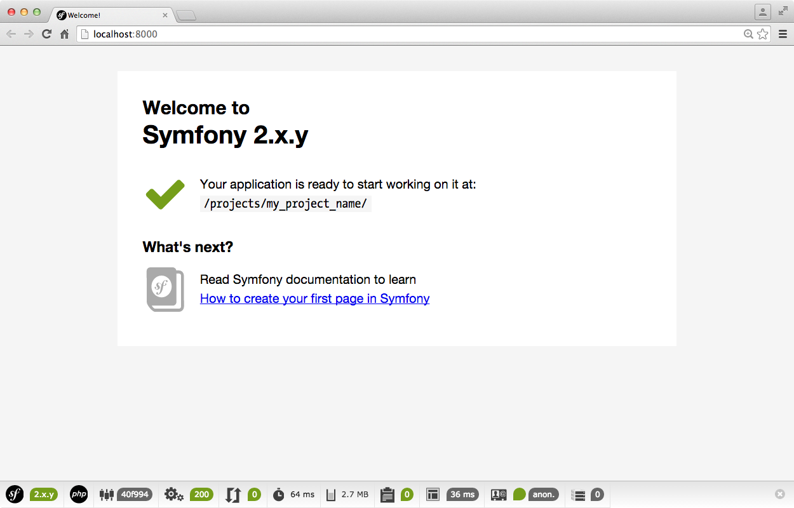

# Introduction

Ces premiers TD vont nous permettre d'appréhender le [Framework PHP Symfony 2](https://symfony.com/).

Un framework est un cadre de travail de développement basé sur un certain de nombre [composant](https://symfony.com/components)

## Méthodes d'installation

Plusieurs méthodes peuvent être utiliser afin d'initialiser un projet basé sur Symfony full-stack - [Voir les différentes distributions](https://symfony.com/distributions)

* `Synfony Installer` - recommandé
* `Composer` 
* `ZIP Package`

## Symfony Installer

Nous allons récupérer un executable qui va automatiser un certain nombres de tâches afin d'instancier un projet
Symfony2.

Cet installer, nous allons le mettre dans notre `~/bin`

```
$ curl -LsS http://symfony.com/installer -o ~/bin/symfony
```
```
$ chmod a+x ~/bin/symfony
```

*Cet exécutable accepte différents arguments :*

1. Commande à éxécuter (`new`, `self-update`)
2. Le nom du projet avec la commande `new`
3. Version de Symfony désiré (`2.6.5`, `2.7.0-RC1`, `lts`)

**Du coup, afin d'instancier un projet**

```
$ symfony new new_project
```

### Que fait-il ?

Cet [utilitaire](https://github.com/symfony/symfony-installer) nous permet d'automatiser plusieurs tâches. 

* Vérifie les permissions
* Téléchargement du paquet
* Extrait le paquet
* Met à jour les paramètres - `app/config/parameter.yml`
* Met à jour les composer.json
* Créer un fichier `.gitignore`
* Vérifie les prérequis


### Qu'obtient-on ?

	app/							# Répertoire des fichiers de application globale
		cache						# Répertoire d'écriture du cache
		config						# Répertoire de configuration de application globale
			configdev.yml			# Configuration environnement dev
			configprod.yml			# Configuration environnement prod
			configtest.yml			# Configuration environnement test
			config.yml				# Configuration environnement global
			parameters.yml			# Paramètre application
			parameters.yml.dist		# Template d'un fichier de paramétrage
			routingdev.yml			# Configuration routing dev
			routing.yml				# Configuration routing
			security.yml			# Configuration de la sécurité
			services.yml			# Configuration des services
		logs						# Dossier des logs
		Resources					# Ressources application globale (static + templates)
		AppCache.php				# Paramétrage du cache
		AppKernel.php				# Kernel loading
		autoload.php				# 
		bootstrap.php.cache
		check.php
		console						# console pour les CLI
		phpunit.xml.dist
		SymfonyRequirements.php
	bin/							# exécutable tierce partie
	src/
		AppBundle/					# Bundle métier 
	vendor/							# Vendor distribution full-stack
		composer
		doctrine
		incenteev
		jdorn
		kriswallsmith
		monolog
		psr
		sensio
		sensiolabs
		swiftmailer
		symfony
		twig
		autoload.php
	web/							# Répertoire accessible du web
		app_dev.php					# Controller principal de l'application en mode dev
		app.php						# Controller principal de l'application en mode prod
		apple-touch-icon.png
		bundles
		config.php
		favicon.ico
		robots.txt
	composer.json
	composer.lock
	README.md

**Lancer l'application**

En mode développement, Symfony2 peut se lancer en s'appuyant sur le [built-in Web Server de php](http://php.net/manual/en/features.commandline.webserver.php) grâce à la commande :

```
$ app/console server:run
```
[+ informations](http://symfony.com/doc/current/book/installation.html#running-the-symfony-application)

Vérifier le bon fonctionnement de l'installation en accédant via votre navigateur à l'URL [http://127.0.0.1:8000](http://127.0.0.1:8000) indiqué par le built-in Web Server de PHP 



## Help

**Rendre le `~/bin` global**

Il faut modifier notre .bashrc 

```
$ vi ~/.bashrc
```

Et eporter $PATH en y ajoutant notre `~/bin`

```
export PATH=$PATH:~/bin
```

Ne pas oublier de recharger `.bashrc` 

```
$ source ~/.bashrc
```

